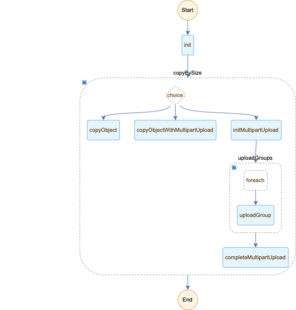

## 简介

本应用使用 Serverless 工作流从一个 OSS Bucket 复制文件到另一个 Bucket，其中源 Bucket 和目标 Bucket 可以在同一个区域也可以在不同区域，可以属于同一个账号也可以属于不同账号。支持增量数据和存量数据复制。


## 使用说明

### 准备工作

如果是同账号文件复制，可以忽略下面的准备工作。如果需要将账号 A 下的 Bucket 文件复制到账号 B 下的 Bucket，则需要账号 B 创建一个角色，该角色允许账号 A 在其指定 Bucket 下创建文件，原理和使用说明参见[文档](https://www.alibabacloud.com/help/zh/doc-detail/93745.htm)。

信任策略如下，将`{AccountA}`替换成账号 A 的账号 ID。
```
{
    "Statement": [
        {
            "Action": "sts:AssumeRole",
            "Effect": "Allow",
            "Principal": {
                "RAM": [
                    "acs:ram::{AccountA}:root"
                ]
            }
        }
    ],
    "Version": "1"
}
```

权限策略如下，将`{DestBucket}`替换成目标 Bucket。更多 OSS 权限管理可以参见[文档](https://help.aliyun.com/document_detail/100680.html)。
```
{
    "Version": "1",
    "Statement": [
        {
            "Effect": "Allow",
            "Action": "oss:PutObject",
            "Resource": ["acs:oss:*:*:{DestBucket}/*", "acs:oss:*:*:{DestBucket}"]
        }
    ]
}
```

### 增量数据复制
增量数据复制依赖于函数计算的 OSS 触发器，当有新文件上传或者文件更新时，OSS 会触发函数 `startSingleCopy`，该函数启动一个流程，逻辑如下：
* 如果要复制的文件比较小（比如 50MB 以内），会使用函数 `copyObject` 流式下载文件并上传文件到目标 Bucket。
* 如果要复制的文件比较大（比如 50MB 到 1GB），会使用函数 `copyObjectWithMultipartUpload` 多线程分片下载文件并分片上传到目标 Bucket。
* 如果要复制的文件很大（比如 1GB 以上），会使用三个函数完成复制任务。
    * 第一个函数 `initMultipartUpload` 开始分片上传，并将文件分成 group，每个 group 包含多个分片。
    * 第二个函数 `uploadParts` 处理一个 group 里的多个分片，采用多线程复制分片。该函数的多个实例会并行处理所有 group。
    * 第三个函数 `completeMultipartUpload` 完成分片上传。

其中文件大小阈值可以根据具体情况配置，原则是函数执行不超过最长执行时间限制（10分钟）。
* 同区域复制延迟低，文件大小阈值可以适当调大。
* 跨区域复制延迟高，文件大小阈值可以适当调小。



**使用步骤**


1. 使用[Funcraft](https://help.aliyun.com/document_detail/64204.html)部署资源。下面的参数主要是用于增量文件复制，如果不需要对增量文件复制，可以设置一个不存在的 `OSSKeyPrefix`。
    * `SrcBucket`指定了源 Bucket
    * `DestBucket`指定了目标 Bucket
    * `OSSKeyPrefix`指定了源 Bucket 的某个路径，可以不指定。指定后，只有该路径下的文件才会被复制到目标 Bucket。
    * `OSSKeySuffix`指定了源 Bucket 的文件后缀，可以不指定。指定后，只有以此后缀结束的文件才会被复制到目标 Bucket。
    * `DestAccessRole` 指定了访问目标 Bucket 所需要的角色，只需要在跨账号复制场景下指定。如复制A账号的文件到B账号，该角色是由B提供，授权A账号写B账号 OSS 的权限。
```
    fun package -b bucket-for-package-functions
    fun deploy --use-ros --stack-name oss-cp -p 'SrcBucket=hangzhouhangzhou' -p 'DestBucket=fc-code-1584293594287572-hangzhou' -p 'OSSKeyPrefix=test-copy1' -p 'OSSKeySuffix=' -p 'DestOssEndpoint=oss-cn-hangzhou-internal.aliyuncs.com' -p 'DestAccessRole=acs:ram::1584293594287572:role/oss-put`
```
2. 使用 ossutil 上传文件到源 Bucket，该文件会被同步到目的 Bucket。也可以通过控制台上传文件。

    ```ossutil -e http://oss-cn-hangzhou.aliyuncs.com -i ak -k secret  cp ~/Downloads/testfile oss://hangzhouhangzhou/test-copy1/```


### 存量数据复制
存量数据复制流程如下：
`listObjects` 函数通过 OSS ListObjects API 构造文件组，按照文件大小将文件分成 3 组。
* 第一组是小文件。`copyObjects` 函数负责处理多个小文件。每次函数执行处理的所有小文件大小可配置。
* 第二组是大文件。`copyObjectWithMultipartUpload` 函数负责处理大文件。
* 第三组是超大文件。`initMultipartUpload`，`uploadParts`，`completeMultipartUpload` 函数负责处理超大文件。


**使用步骤**

1. 使用[Funcraft](https://help.aliyun.com/document_detail/64204.html)部署资源。

```
    fun package -b bucket-for-package-functions
    fun deploy --use-ros --stack-name oss-cp -p 'SrcBucket=hangzhouhangzhou' -p 'DestBucket=fc-code-1584293594287572-hangzhou' -p 'OSSKeyPrefix=this-does-not-exist' -p 'OSSKeySuffix=this-does-not-exist' -p 'DestOssEndpoint=oss-cn-hangzhou-internal.aliyuncs.com'

    ROS Stack Outputs:

    ┌───────────────────────────┬─────────────────────────────────────────────┬────────────────────────────────────────┐
    │ OutputKey                 │ OutputValue                                 │ Description                            │
    ├───────────────────────────┼─────────────────────────────────────────────┼────────────────────────────────────────┤
    │ CopyMultipleFilesFlowName │ cp-test1-CopyMultipleFilesFlow-098FDDA34A4C │ The name of the CopyMultipleFilesFlow. │
    ├───────────────────────────┼─────────────────────────────────────────────┼────────────────────────────────────────┤
    │ CopySingleFileFlow        │ cp-test1-CopySingleFileFlow-64B1E6B4EBDB    │ The name of the CopySingleFileFlow.    │
    └───────────────────────────┴─────────────────────────────────────────────┴────────────────────────────────────────┘
```

2. 复制文件：使用[阿里云 CLI](https://help.aliyun.com/document_detail/122611.html) 执行流程。使用控制台请参见[文档](https://help.aliyun.com/document_detail/124156.html)。执行使用下面的输入格式。该输入将会把 `hangzhouhangzhou` bucket 下的所有文件复制到 `fc-code-1584293594287572-hangzhou` bucket。其中输入参数说明如下：
    * `src_bucket`指定了源 Bucket
    * `dest_bucket`指定了目标 Bucket
    * `dest_oss_endpoint` 指定了目标 Bucket OSS endpoint
    * `prefix`指定了源 Bucket 的某个路径，只有该路径下的文件才会被复制到目标 Bucket。如果为空，则复制源 Bucket 下所有文件。
    * `marker` 指定了以源 Bucket 中某个文件开始复制。如果为空，则复制源 Bucket 下所有文件。
    * `dest_access_role` 指定了访问目标 Bucket 所需要的角色，只需要在跨账号复制场景下指定。如复制A账号的文件到B账号，该角色是由B提供，授权A账号写B账号 OSS 的权限。


```
    aliyun fnf StartExecution --FlowName cp-test1-CopyMultipleFilesFlow-098FDDA34A4C --Input '{"src_bucket": "hangzhouhangzhou",   "dest_oss_endpoint": "oss-cn-hangzhou-internal.aliyuncs.com",   "dest_access_role": "acs:ram::1584293594287572:role/assume-role",   "dest_bucket": "fc-code-1584293594287572-hangzhou",   "prefix": "test-oss-copy",   "marker": "",   "delimiter": ""}' --ExecutionName run1
```

## 优势
* 支持任意大小文件的复制。
* 可靠的复制：依赖于函数工作流的重试功能。


## 优化
* 检查 crc 确保数据的完整性